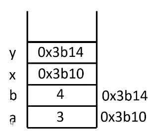
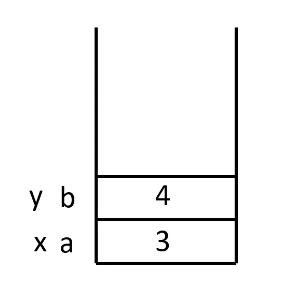
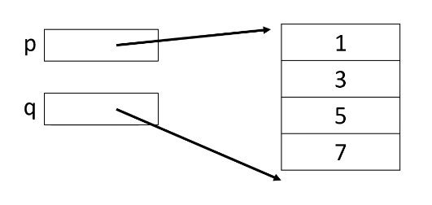
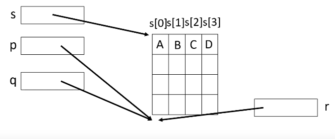
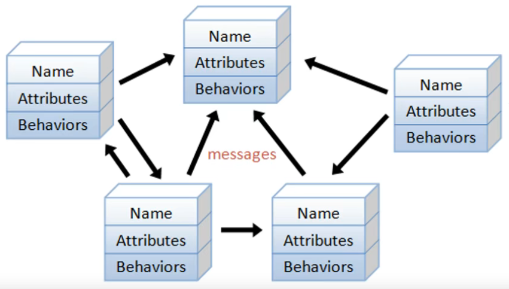

## 从C到C++

### 1. C++标准输入输出

 - 包含头文件
 ```c++
#include<iostream>
 ```

- cout是一个标准输出流对象，代表控制台窗口
- <<是一个运算符，假如o是一个输出流对象，x是一个数据则：

```c++
o << x
```

- cout是标准名字空间std的一个名字。必须加上名字空间限定std::

### 2. 名字空间

​	在名字空间中的变量，使用时要引入名字空间。

​	有三种方法：

```c++
using std::cout;
using namespace std;
std::cout;
```

### 3. 引用变量

- 引用变量是其他变量的别名。如同一个人的外号或小名
- 定义引用变量时，必须指明其引用的是哪一个变量

```c++
int a = 3;
int &r = a;
```

- 引用变量“从一而终”，一旦定义就不能再引用其他变量

```c++
//error
int &r = a;
int &r = b;
```

- 引用变量和被引用的变量类型必须匹配

```c++
//error
double d;
int &r = d;
```

### 4. 引用形参

​	在c中，要改变外部变量的值时，需要用到地址进行传参：

```c
//C code:
void swap(int *x , int * y){
    int t = *x;
    *x = *y;
    *y = t;
}

int main(){
    int a = 3; b = 4;
    swap(&a , &b);
}
```

​	运行过程中的main的栈如下：



​	在C++中，则可以使用引用变量来传参：

```c++
#include <iostream>
using namespace std;

void swap(int &x,int &y){
    int t = x;
    x = y;
    y = t;
}


int main(){   
    int a = 3, b = 4;
    cout << a << '\t' << b << endl;
    swap(a,b);
    cout << a << '\t' << b << endl;
}
```

​	引用形参使得函数能够直接去访问外部变量的内存块：



### 5. 函数的默认形参

- 函数的形参可以有默认值

```c++
void print(char ch , int n = 1);
```

- 默认形参必须在非默认形参右边，即一律靠右

```c++
add(x = 1 , y , z = 3);//error
add(y , x = 1 , z = 3);
```

### 6. 函数重载

- C++允许同意作用域里有同名的函数，只要它们的形参不同。如：

```c++
int add(int x, int y);
double add(double x, double y);
```

- 函数名和形参列表构造了**函数的签名**
- 函数重载不能根据返回类型区分函数。如：

```c++
int add(int x, int y);
double add(int x, int y);
```

- 歧义性

```c++
#include<iostream>
using namespace std;
int add(int x, int y = 2){
    return  x + y;
}
double add(double x, double y = 2.0){
    return  x + y;
}
int main(){
    cout<< add(5,3) <<endl;
    cout<< add(5.3,7.8) <<endl;
    cout<< add(5,7.8) <<endl;//error
    cout<< add((double)5,7.8) <<endl;//error
}
```

### 7. 函数模板

- 通用算法：函数模板，也称为泛型函数

```c++
int add(int x, int y);
double add(double x, double y);
```

- 用template关键字增加一个模板头，将数据类型变成类型模板参数

```c++
template<typename T>
T add(T x , T y){
    return x + y;
}
```

- 给模板参数传递实际的模板参数

```c++
cout << add<int>(5,3) << endl ;
cout << add<double>(5,3) << endl ;
```

- 模板参数自动推断，但是也会有歧义性

```c++
cout << add(5,3) << endl ;
cout << add(5.3,7.8) << endl ;

cout << add(5,7.8) << endl ;//error
```

### 8. 自定义类型string

- string 是一个用户定义类型，表示的是符串

```c++
string s = "hello" , s2("world");
```

- 用成员访问运算符 . 访问string类的成员

```c++
cout << s.size() << endl;
string s3 = s.substr(1, 3);
cout << s3 << endl;
```

- 用运算符对string对象进行运算，如+、[]

### 9. 自定义类型vector

- 内在的数组，是静态数组。定义之后不能增加
- vector 类似于数组，可以动态增长，头文件：

```c++
#include <vector>
```

- 是一个类模板，实例化产生一个类，如下列代码产生一个数据类型是int的vector<int>类（向量）

```c++
vector<int>
```

- 可以通过vector<int>类对象去访问其成员，如成员函数

```c++
#include <iostream>
#include <vector>
using namespace std;
int main() {
    vector<int> v = { 7,5,16,8 };
    v.push_back(25);
    v.push_back(13);
    for (int i = 0; i < v.size(); i++)
        cout << v[i] << '\t';
        cout << '\n' << endl;
    v.pop_back();
    for (int i = 0; i < v.size(); i++)
        cout << v[i] << '\t';
        cout << '\n' << endl;
    v.resize(2);
    for (int i = 0; i < v.size(); i++)
    cout << v[i] << '\t';
    cout << '\n' << endl;
}
/* 
out:
7       5       16      8       25      13
7       5       16      8       25
7       5
*/
```

### 10. 动态内存分配

- 约定：指针就是地址，变量的指针就是变量的地址。可以用取地址运算符&获得一个变量的地址。如：

```c++
&var
```

- 指针变量就是存储指针（地址）的变量。如：

```c++
T *P;
```

​	   p是存储“T类型变量的地址”的变量

- 通过取内容运算符 * 可以得到一个指针变量指向的变量， *p 就是 p所指向的那个变量。

- 在堆存储区申请内存

```c++
#include <iostream>
using namespace std;
int main(){
    int *p = new int; //c code : malloc
    *p = 3;
    cout << p << '\t' << *p <<endl;
    delete p; //Free memory
    int *p = new int; //c code : malloc
    *p = 3;
    cout << p << '\t' << *p <<endl;
    delete p;
}
```

​	如果申请后，没有释放掉，又用相同的指针去指向其他地址，会导致原本申请的地址无法释放，导致内存泄漏。

- 用指针指向多个int型的内存块

```c++
#include <iostream>
using namespace std;
int main() {
    int n = 4;
    int* p = new int[n];
    for (int i = 0; i < n; i++)
        p[i] = 2 * i + 1;

    for (int* q = p + n; p < q; p++)
        cout << p << ":" << *p << '\t';
    cout << "\n";
}

/*
out:
00CFB528:1      00CFB52C:3      00CFB530:5      00CFB534:7
*/
```



```c++
#include <iostream>
using namespace std;
int main() {
int n = 4;
int *p = new int[n];
char *s = (char *)p;
char ch = 'A';
int n2 = n * sizeof(int) / sizeof(char);
for (int i = 0; i < n2; i++)
	s[i] = ch + i;
for (char* r = s + n2; s < r; s++)
	cout << *s;
cout << "\n";
delete[] p;
}
```



### 11. 类和对象

- 传统的过程式编程：变量（对象）就是一些存储数据的内存块，而过程（函数）对这些数据进行处理

- 面向对象编程：程序是由不同种类的许多对象相互协作完成的。对象之间通过发送/接收消息来协作完成各种任务。由这些对象构成的程序也称为“对象式系统”



```c++
struct student{
    string name;
    double score;
    void print(){
        cout<<name<<" "<<score<<endl;
    }
}

int main(){
    student stu;
    stu.name = "Liping";
    stu.score = 78.9;
    stu.print();
}
```


### 12. this指针

​	在编译器中，对于上述的类中的方法，实际是转化成了这样子的函数：

```c++
void print(*this){
	cout << this->name << " " << this->score << endl;
}
//···
print(&stu);
```

### 13. 访问控制

​	struct和class的区别：

- struct里的成员默认是public（公开的）
- class里的成员默认是private（私有的）

​	对于私有成员，可以定义get、set方法进行读取和修改


```c++
class student{
    string name;
    double score;
public:
    void print(){
        cout<<name<<" "<<score<<endl;
    }
    string get_name(){return name;}
    double get_name(){return score;}
    void set_name(string n){name = n;}
    void set_score(double s){score = s;}
};
```

### 14. 构造函数

- 构造函数的函数名和类名相同
- 没有定义构造函数时，C++会自己自动定义一个构造函数
- 默认构造函数不带参数，或者参数都有默认值

```c++
class student{
    string name;
    double score;
public:
    void student(string n,double s){
        name = n;
        score = s;
        cout << "构造函数\n";
    }
    void print(){
        cout<<name<<" "<<score<<endl;
    }
    string get_name(){return name;}
    double get_name(){return score;}
    void set_name(string n){name = n;}
    void set_score(double s){score = s;}
};

int main(){
	student("LiPing , 80.5");
}
```

- 对于没有默认构造函数的类，没有办法直接定义数组

```c++
int main(){
	student students[3];//error
}
```

### 15. 运算符重载

```c++
int main(){
	student("LiPing , 80.5");
    stu.print();
    cout << stu ; //error
}
```

	- 如果要直接cout输出的话，要重载 << 运算符

```c++
ostream& operator<<(ostream &o , student s){
    cout << s.name << "," << s.socre << endl;
    return o;
}
```

- 由于class中的成员是私有成员，上述函数无法直接访问，要添加其作为student 的友元函数

``` c++
friend ostream& operator<<(ostream& o, student s);
```

### 16.  拷贝构造函数

```c++
class String{
    char *data ; // C code
    int n ;      // Length of the string
public :
    //constructor
    String(const char *s = 0){
        if(s == 0){
            data = 0; n = 0 ;return;
        }
        const char *p = s;
        //while(*p != '\0') p++;
        while(*p) p++;
        n = p - s;  //Length
        data = new char[n + 1];
        for(int i = 0; i < n; i++)
            data[i] = s[i];
        data[n] = '\0';
    }
    
    int size(){return n;}              //return size
    
    char operator[](int i)const{        //read only
        if(i<0 || i>=n) throw "下标非法";
        return data[i];
    }
    
    char& operator[](int i){            //write only
        if(i<0 || i>=n) throw "下标非法";
        return data[i];
    }
};
```

### 17. 析构函数


char *s = "hello world" 的解释：https://blog.csdn.net/weixin_30737433/article/details/98551929
