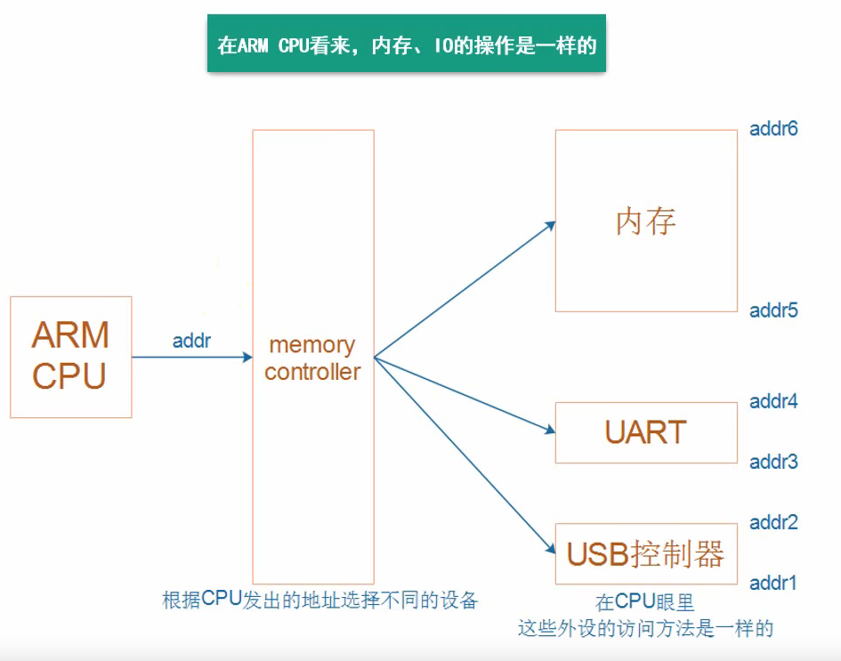
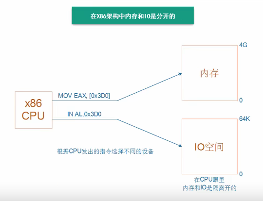
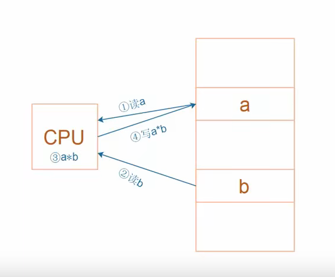
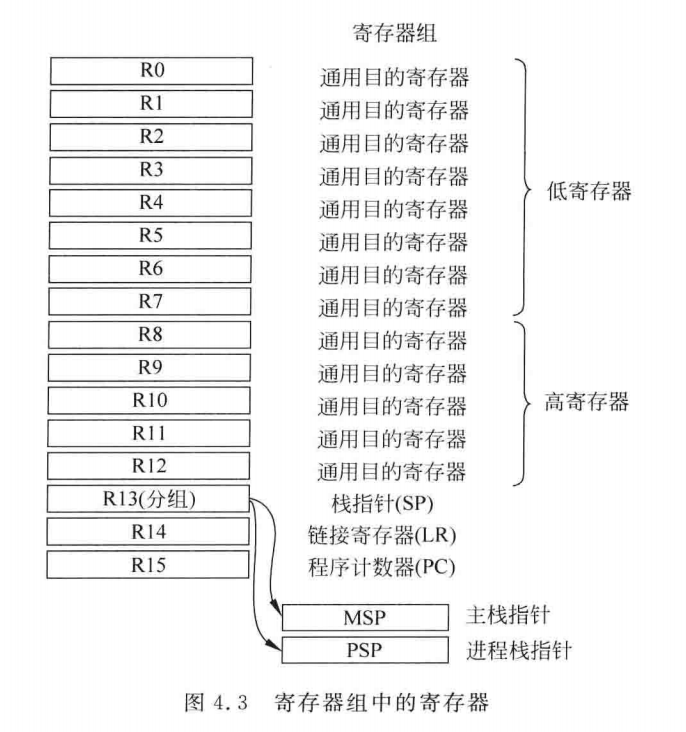
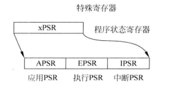
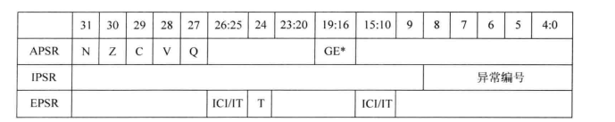

#### 地址空间

##### ARM架构



​	在ARM CPU看来，内存和IO操作是一样的。

##### x86架构



​		在x86架构中，则是通过发出不同的指令来控制不同的设备。

#### RISC和CISC

##### RISC

​	ARM芯片属于精简指令集计算机（RISC：Reduced Instruction Set Computer），它所用的指令比较简单，有如下特点：

- 对内存只有读、写指令；

- 对于数据的运算是在CPU内部实现的；

- 使用RISC指令的CPU复杂度小一点，易于设计

  例如：对于下图所示的乘法运算a = a * b，

  在RISC中要使用到4条汇编指令：

  1. 读内存a
  2. 读内存b
  3. 计算a*b
  4. 把结果写入内存a



##### CISC

​	x86属于复杂指令集计算机（CISC：Complex Instruction Set Computer），它所用的指令比较复杂，比如某些复杂的指令，它是通过“微程序”来实现的。比如执行乘法指令时，实际上会去执行一个“微指令”。

​	虽然在微指令里面一样执行上述四个步骤，但是对于程序员来说，是一个黑箱。

#### ARM通用寄存器

​	Cortex-M3和Cortex-M4处理器的寄存器组中有16个寄存器，其中13个位32位通用目的寄存器，其他3个则有特殊用途，如图：



##### 通用寄存器R0~R12

​	寄存器R0~R12位通用目的寄存器，前8个（R0~R7）也被称作低寄存器。由于指令中可用的空间有限，许多16位指令只能访问低寄存器。高寄存器（R8~R12）则可以用于32位指令和几个16位指令，如MOY（move），R0~R12的初始值是未定义的。

##### R13~R15

R13：别名SP（Stack Pointer），栈指针，分为SP_main（用于main函数），和SP_process（用于线程模式，如rtos）

R14：别名LR（Link Register），用来保存返回地址

R15：别名PC（Program Counter），程序计数器，表示当前指令地址，写入新值即可跳转

##### 特殊寄存器



​		xPSR



​	这三个寄存器可以单独访问：

```assembly
MRS R0, APSR ; 读APSR
MRS R0, IPSR ; 读IPSR
MSR APSR, R0 ; 写APSR
```


   也可以一次性访问

```assembly
MRS R0 , PSR ; 读组合程序状态
MSR PSR , R0 ; 写组合程序状态
```

#### ARM汇编

##### 汇编指令

 - 内存R/W
 - 运算
 - 跳转/分支
 - 比较

##### 指令集

- ARM （32位）

- Thumb  （16位）

- Thumb-2

  在xPSR寄存器的第24位，为1时，为Thumb指令，为0时为Arm指令

  Thumb-2指令集可以混合使用16位和32位指令集

##### 汇编指令格式

###### 立即数

​	立即数 = 某个8位数 循环移位（rotate）偶数位

###### LDR伪指令

​	想把任意数值赋给R0，可以使用LDR：

```assembly
LDR R0, =VAL
```

​	编译器会把“**伪指令**“替换成**真实的指令**

###### ADR

​	用来读某个标号的地址，例如：

```assembly
ADR R0 , Loop

loop 
	ADD R0 , R0 ,#1
```

#### 内存访问指令

- LDR：Load Register
- STR：Store Register
- LDM：Load Multiple Register
- STM：Store Multiple Register

##### LDR 

​	LDRx：x代表数据读取数据的类型

​		如LDRB，是读取一字节的数据

